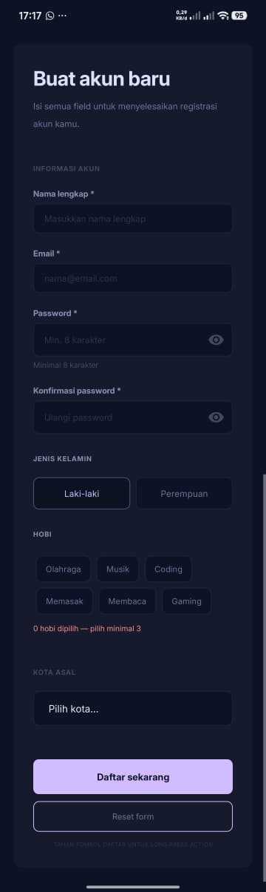

# Emptyviews

Repository ini berisi hasil pengerjaan **Tugas 5**.

## Ringkasan Tugas 5

Tugas ini menampilkan sebuah form pendaftaran yang dibuat dalam tampilan Android sederhana. Isi utamanya meliputi:

- judul form
- isian data pengguna
- pilihan tambahan sesuai kebutuhan form
- tombol daftar dan reset

## File Utama

Dua file utama untuk tugas ini adalah:

- [tugas5.xml](app/src/main/res/layout/tugas5.xml)
- [Tugas5activity.kt](app/src/main/java/com/example/empty_views/Tugas5activity.kt)

## Screenshot

## Catatan

- Tampilan dan logika form diletakkan di dua file di atas.
- README ini hanya mencakup Tugas 5.
- Project sudah sempat diuji dalam mode debug.

## Demo Video

Untuk demo video bisa di akses lewat link berikut: [https://www.youtube.com/watch?v=Y8ae465EQLM](https://www.youtube.com/watch?v=Y8ae465EQLM)